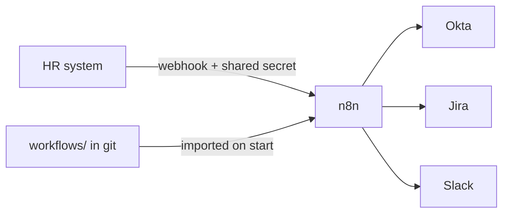

<p align="center">
  
</p>

<p align="center">
  <a href="https://github.com/RyanMH24/W0RKFL0W5/actions/workflows/ci.yml"></a>
</p>

Self-hosted **n8n** automations for the employee identity lifecycle: one webhook from HR onboards a new hire across **Okta, Jira, and Slack**, and another offboards a leaver securely, with an audit trail. Built the way a platform team would run it: workflows as code in git, reviewed through pull requests, and tested end-to-end in **GitHub Actions** against a real n8n instance on every change.

## What it does

**Onboarding** (`POST /webhook/onboard`)
1. Validates the request and resolves access from a role-based [access policy](config/access-policy.json) (baseline + department groups).
2. Creates the Okta account as **STAGED** (or finds the existing one) and adds it to each policy group.
3. Opens a Jira setup ticket listing what was automated and what's left (laptop, activation, Day 1 check).
4. Announces the hire in `#it-onboarding` and DMs the manager in Slack.

**Offboarding** (`POST /webhook/offboard`)
1. Snapshots the user's Okta groups into a Jira **audit ticket** before changing anything.
2. Revokes all Okta sessions and OAuth tokens, then deactivates the account.
3. Alerts `#it-alerts` with the ticket link.

**Failures** in either flow are retried, then routed to an error workflow that opens a Jira incident and alerts Slack with a link to the failed execution.



## Engineering highlights

- **Idempotent and replay-safe.** Lookup-before-create, idempotent group adds, and label-keyed Jira tickets mean the fix for almost any failure is "replay the request": no duplicate accounts, tickets, or Slack spam. ([ADR 0003](docs/adr/0003-idempotent-replay-safe-provisioning.md))
- **Workflows as code.** Git is the source of truth; n8n re-imports `workflows/` on every start, so production can't drift from `main`. ([ADR 0002](docs/adr/0002-workflows-as-code.md))
- **Enforced standards.** A CI validator fails any workflow with an unauthenticated webhook, an inline token, a hardcoded host, an HTTP call without retries, a missing error workflow, or an unreachable node.
- **Secure defaults.** Tokens live only in n8n's encrypted credential store; workflows can't read environment variables; Code nodes run in isolated task runners; admin groups are blocked outside IT by a policy test. ([ADR 0004](docs/adr/0004-secrets-and-configuration.md))
- **Security-first offboarding.** Audit snapshot, then session revocation, then deactivation, so access is cut fast and the record survives partial failures. ([ADR 0006](docs/adr/0006-offboarding-order-of-operations.md))
- **Real end-to-end tests without secrets.** Contract mocks of the Okta, Slack, and Jira APIs, with fault injection, let CI test happy paths, replays, bad input, auth, and a vendor outage on every PR. ([ADR 0005](docs/adr/0005-contract-mocks-for-ci.md))

## Quick start

Requires Docker and Node 24.

```bash
cp .env.example .env            # defaults use the mock services
docker compose up -d --build --wait
npm run e2e                     # 8 end-to-end scenarios against the running stack
```

Then try it yourself:

```bash
curl -X POST http://localhost:5678/webhook/onboard \
  -H "Content-Type: application/json" \
  -H "X-W0RKFL0W5-Secret: change-me-local-webhook-secret" \
  -d '{"employeeId":"E1001","firstName":"Ada","lastName":"Park","workEmail":"ada.park@example.com",
       "department":"Engineering","title":"Software Engineer","managerEmail":"dana.lee@example.com",
       "startDate":"2026-11-02"}'

curl -s http://localhost:4010/__state     # what the workflow did in the mock Okta/Jira
```

Open **http://localhost:5678** to see the workflows and every execution in the n8n editor (create the owner account on first visit).

To run against real **Okta, Slack, and Jira** free developer accounts, see [docs/real-accounts.md](docs/real-accounts.md); it's a `.env` change only.

## Testing

| Command | What it covers |
|---|---|
| `npm run validate` | Static checks on every workflow (see above) |
| `npm test` | Unit tests: mock API contracts, access-policy guardrails, validator rules |
| `npm run e2e` | Onboard, replay, offboard, replay, unknown user, invalid input, missing secret, and an Okta outage that must retry and raise an incident |

All three run in [CI](.github/workflows/ci.yml) on every pull request; the e2e job starts the full Docker Compose stack.

## Docs

- [Architecture](docs/architecture.md): system view, sequence diagrams, failure handling
- [Architecture decision records](docs/adr/)
- [Runbook](docs/runbook.md): failed runs, replays, policy changes, secret rotation, upgrades
- [Real accounts setup](docs/real-accounts.md)

## Stack

n8n 2.42 (self-hosted, external task runners) · Postgres 17 · Docker Compose · Node 24 (no npm dependencies) · GitHub Actions · Okta Management API · Slack Web API · Jira Cloud REST API
