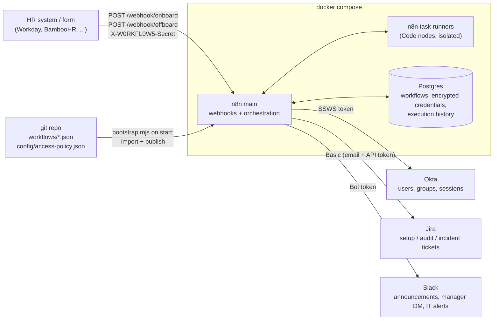
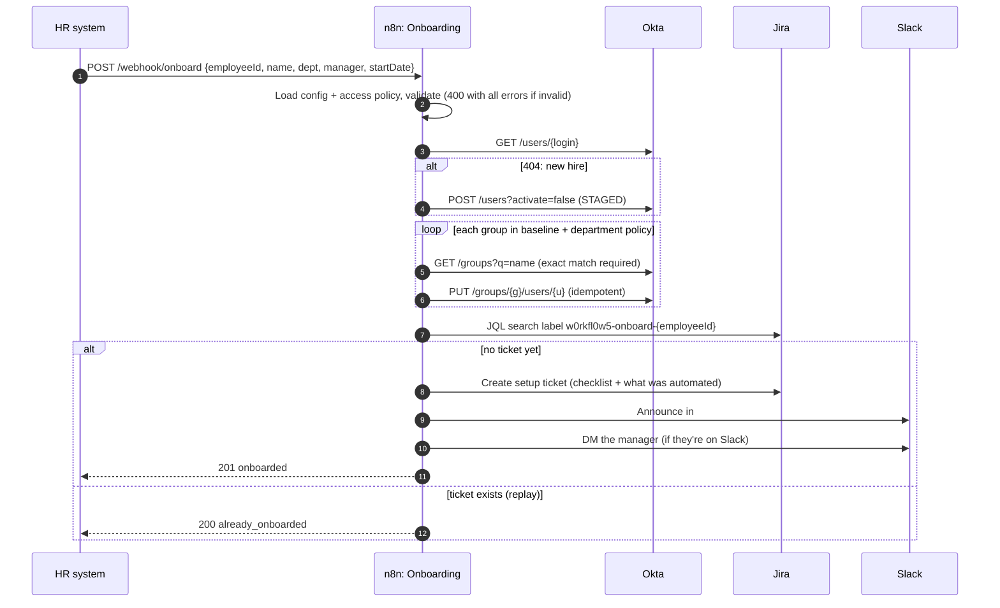
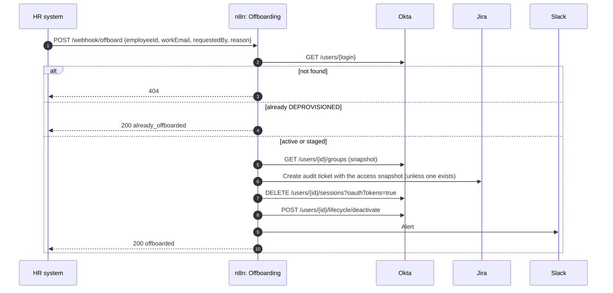
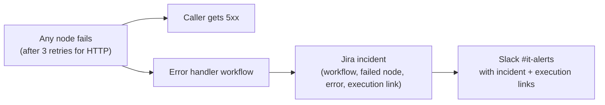

# Architecture

## System view

In development and CI, Okta, Slack, and Jira are replaced by `mocks/server.mjs` (see [ADR 0005](adr/0005-contract-mocks-for-ci.md)).

## Onboarding

## Offboarding

Order of operations is deliberate; see [ADR 0006](adr/0006-offboarding-order-of-operations.md).

## Failure handling

- Every HTTP Request node retries 3 times, 1 second apart.
- Slack returns errors as HTTP 200 with `ok: false`; the onboarding announce step checks for that explicitly and fails the run if Slack rejected it.
- Non-critical steps (manager DM, offboarding Slack alert) continue on error and report the outcome in the response instead of failing the run.
- The error handler creates the Jira incident with "continue on error", so the Slack alert still goes out if Jira is the thing that's down.

## Repository layout

| Path | Purpose |
|---|---|
| `workflows/` | n8n workflow JSON, the source of truth ([ADR 0002](adr/0002-workflows-as-code.md)) |
| `config/access-policy.json` | Role-based access: baseline + per-department Okta groups |
| `scripts/bootstrap.mjs` | n8n entrypoint: writes runtime config, imports credentials and workflows, publishes, starts |
| `scripts/validate-workflows.mjs` | Static checks enforced in CI |
| `scripts/e2e.mjs` | End-to-end scenarios against the running stack |
| `mocks/` | Contract mocks for Okta, Slack, and Jira |
| `tests/` | Unit tests for the mocks, policy guardrails, and validator |
| `docs/adr/` | Architecture decision records |
